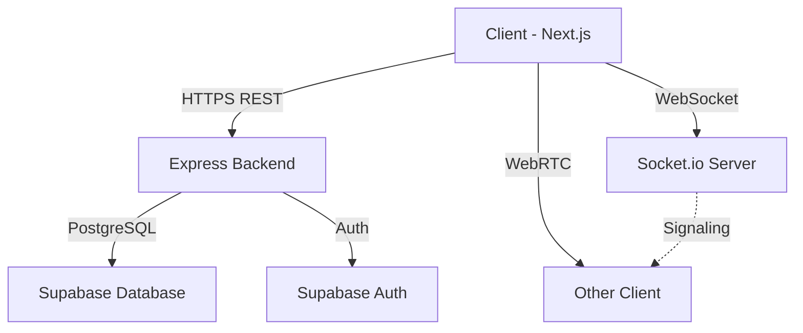

# 1-on-1 Mentorship Platform

Build a web-based 1-on-1 mentorship platform where a mentor and a student can join a private session, video call in real time, chat via messages, and collaboratively edit code in a shared editor.

## Architecture Design

- **Frontend**: Next.js (App Router), React, TypeScript, Tailwind CSS, Monaco Editor
- **Backend**: Node.js, Express.js, Socket.io (for real-time chat and code sync), WebRTC signaling
- **Database**: PostgreSQL (via Supabase) for user management, sessions, and messages
- **Infrastructure**: Vercel (Frontend), Render/Railway (Backend)

### System Architecture

## Database Schema Design (ER Diagram)

### `users`
- `id` (UUID, PK)
- `email` (String)
- `full_name` (String)
- `role` (Enum: 'MENTOR', 'STUDENT')
- `created_at` (Timestamp)

### `profiles`
- `id` (UUID, PK)
- `user_id` (UUID, FK -> users.id)
- `bio` (Text)
- `skills` (Array of Strings)

### `sessions`
- `id` (UUID, PK)
- `mentor_id` (UUID, FK -> users.id)
- `student_id` (UUID, FK -> users.id, nullable)
- `title` (String)
- `status` (Enum: 'SCHEDULED', 'ACTIVE', 'COMPLETED')
- `created_at` (Timestamp)
- `started_at` (Timestamp, nullable)

### `messages`
- `id` (UUID, PK)
- `session_id` (UUID, FK -> sessions.id)
- `sender_id` (UUID, FK -> users.id)
- `content` (Text)
- `created_at` (Timestamp)

### `code_snapshots` (Optional)
- `id` (UUID, PK)
- `session_id` (UUID, FK -> sessions.id)
- `code` (Text)
- `language` (String)
- `updated_at` (Timestamp)
