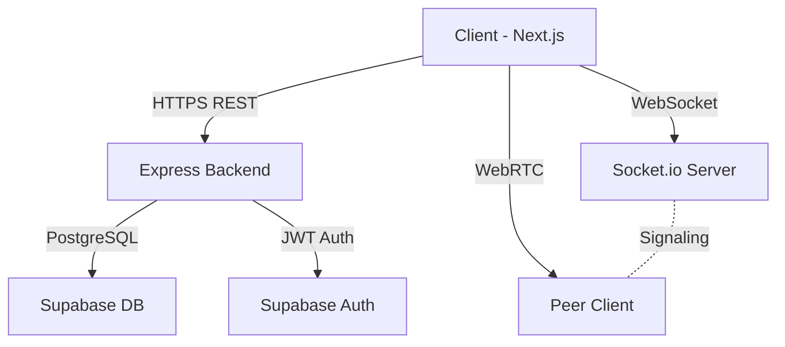

# MentorSpace — 1-on-1 Mentorship Platform

> A real-time collaborative workspace for mentors and students. Code together, video call via WebRTC, and chat — all in one private room.

[](https://nextjs.org/)
[](https://supabase.com)
[](https://socket.io)
[](https://webrtc.org)
[](LICENSE)

---

## ✨ Features

| Feature | Description |
|---|---|
| 🎥 **P2P Video Calling** | Direct WebRTC peer-to-peer video — no relay server needed |
| 💻 **Real-Time Code Editor** | Monaco Editor (VS Code engine) synchronized via Socket.io |
| 💬 **Live Chat** | Real-time chat with messages stored in PostgreSQL |
| 🔐 **Auth & Roles** | Supabase Auth with distinct Mentor and Student roles |
| 📋 **Session History** | Full history of past and active sessions |
| 👤 **Profile Page** | User stats, account info, and session overview |
| 🌙 **Dark Mode** | Full dark/light mode support via Tailwind |
| 📱 **Responsive** | Mobile-first, fully responsive design |

---

## 🏗 Architecture

```
┌─────────────────────────────────────────┐
│           Next.js Frontend              │
│  (App Router + React 19 + TypeScript)   │
└────────────────┬────────────────────────┘
                 │ HTTPS REST + WebSocket
        ┌────────▼────────┐
        │ Express Backend │
        │   + Socket.io   │
        └────────┬────────┘
                 │
        ┌────────▼────────┐
        │ Supabase (PG)   │
        │ Auth + Database │
        └─────────────────┘
```



## 🧪 Demo Credentials

For quick testing without signing up, you can use the following demo accounts (ensure you create these via the Signup page first):

| Role | Email | Password |
|---|---|---|
| **Mentor** | `mentor@demo.com` | `password123` |
| **Student** | `student@demo.com` | `password123` |

---

## 🚀 Getting Started

### Prerequisites
- Node.js 18+
- A [Supabase](https://supabase.com) project
- npm

### 1. Clone the repo
```bash
git clone <your-repo-url>
cd mentorship-platform
```

### 2. Set up the database
Run the SQL files in your Supabase SQL editor in this order:
1. `database_setup.sql`
2. `supabase_schema.sql`
3. `supabase_sessions_schema.sql`
4. `supabase_messages_schema.sql`

### 3. Configure environment variables

**Backend** — create `backend/.env`:
```env
PORT=5000
FRONTEND_URL=http://localhost:3000
SUPABASE_URL=your_supabase_url
SUPABASE_ANON_KEY=your_supabase_anon_key
```

**Frontend** — create `frontend/.env.local`:
```env
NEXT_PUBLIC_SUPABASE_URL=your_supabase_url
NEXT_PUBLIC_SUPABASE_ANON_KEY=your_supabase_anon_key
NEXT_PUBLIC_BACKEND_URL=http://localhost:5000
```

### 4. Run locally

**Backend:**
```bash
cd backend
npm install
npm run dev
# Runs on http://localhost:5000
```

**Frontend:**
```bash
cd frontend
npm install
npm run dev
# Runs on http://localhost:3000
```

---

## 🌐 Deployment

### Frontend — Vercel

1. Push your code to GitHub
2. Import the repo in [vercel.com](https://vercel.com) — select the `frontend/` directory as root
3. Add these environment variables in Vercel dashboard:
   - `NEXT_PUBLIC_SUPABASE_URL`
   - `NEXT_PUBLIC_SUPABASE_ANON_KEY`
   - `NEXT_PUBLIC_BACKEND_URL` → your Render backend URL

### Backend — Render

1. Create a new **Web Service** in [render.com](https://render.com)
2. Connect your GitHub repo — set root directory to `backend/`
3. Build command: `npm install && npm run build`
4. Start command: `npm start`
5. Add environment variables:
   - `FRONTEND_URL` → your Vercel app URL
   - `SUPABASE_URL`
   - `SUPABASE_ANON_KEY`

> A `render.yaml` is included for automated deployment configuration.

---

## 📁 Project Structure

```
mentorship-platform/
├── frontend/                  # Next.js App
│   ├── src/
│   │   ├── app/
│   │   │   ├── page.tsx       # Landing page
│   │   │   ├── login/         # Login page
│   │   │   ├── signup/        # Signup page
│   │   │   ├── dashboard/     # Main dashboard
│   │   │   ├── session/[id]/  # Live session room
│   │   │   ├── profile/       # User profile
│   │   │   └── auth/          # Auth server actions
│   │   ├── components/
│   │   │   └── workspace/
│   │   │       └── SessionWorkspace.tsx  # Core real-time component
│   │   └── utils/supabase/    # Supabase client helpers
│   └── vercel.json
├── backend/
│   └── server.ts              # Express + Socket.io server
├── database_setup.sql
├── supabase_schema.sql
├── supabase_sessions_schema.sql
├── supabase_messages_schema.sql
└── render.yaml
```

---

## 🛡 Tech Stack

| Layer | Technology |
|--|--|
| Frontend | Next.js 16, React 19, TypeScript, Tailwind CSS |
| Code Editor | Monaco Editor (`@monaco-editor/react`) |
| Real-time | Socket.io v4 (WebSocket) |
| Video | WebRTC (browser native P2P) |
| Auth | Supabase Auth (JWT) |
| Database | PostgreSQL via Supabase |
| Backend | Node.js, Express 5, TypeScript |
| Deployment | Vercel (frontend), Render (backend) |

---

## 📄 License

MIT © 2026 MentorSpace
